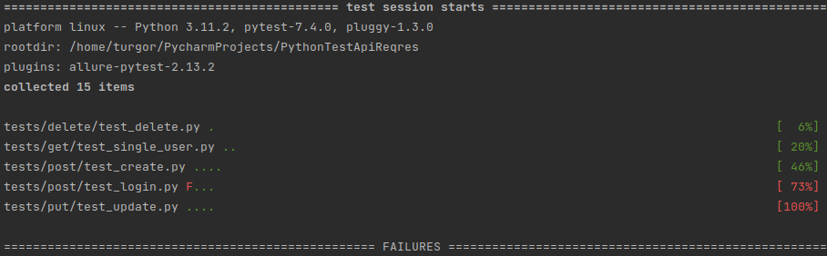
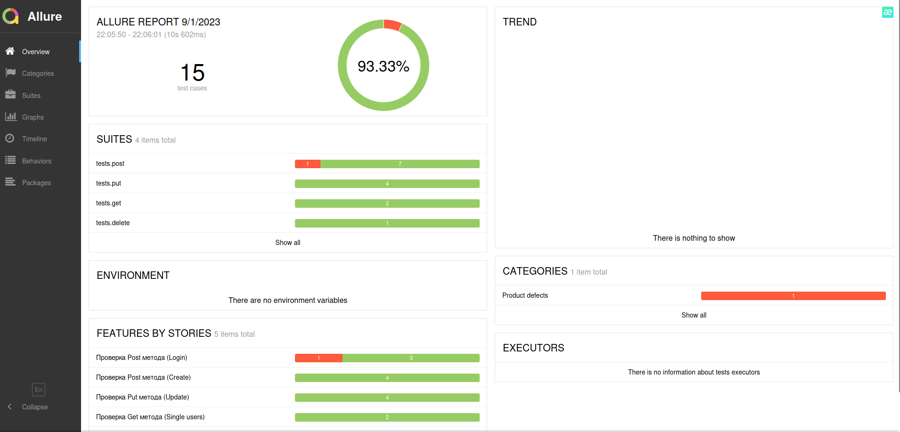
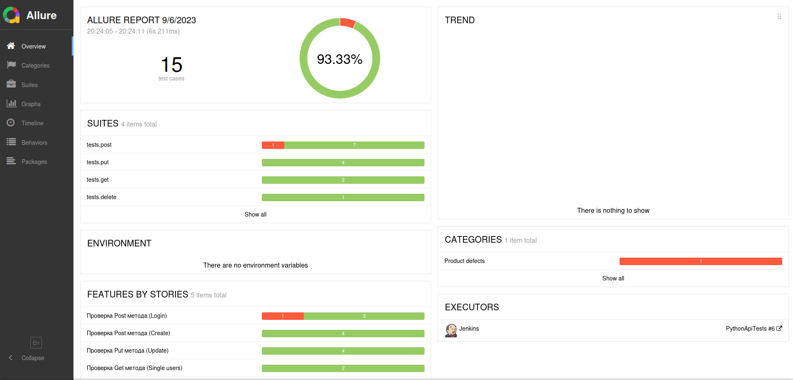

# PythonTestApiReqres

## Описание

Цель проекта: получения навыков в написании API авто тестов на Python 
Сайт для тестирования (<a href="https://reqres.in/">REQRES</a>).

## Окружение

Перед тем как запускать тесты нужно установить необходимые зависемости 
Введите следующую команду (нужно находиться внутри папки проекта): 
<b>pip install -r requirements.txt</b>

## Запуск тестов

Для запуска тестов нужно ввести следующую команду 
<b>py.test --alluredir=allure_report tests/</b>

Для просмотра результатов тестов 
<b>allure serve allure_report/</b>

## Технологии

- Python 3.11.2
- Pytest
- csv
- Allure
- Requests
- Jenkins

## Пример запуска тестов

## Пример Allure отчёта

## Пример Allure отчёта в Jenkins

